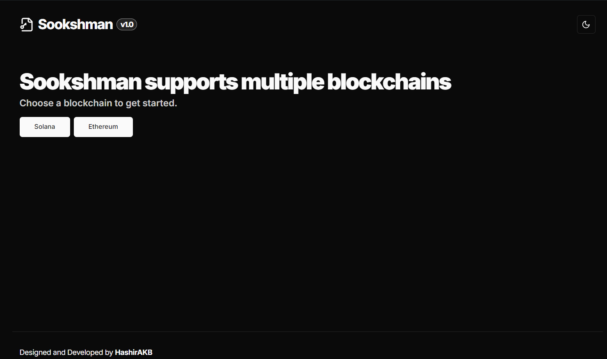

#  Sookshman




Sookshman (meaning "protector" in Malayalam) is a powerful React app for generating and managing cryptocurrency wallets. Whether you're creating new wallets or importing existing ones, Sookshman provides a secure and user-friendly interface for handling your digital assets.

## ✨ Features

- 🆕 **Generate New Wallets**: Create fresh wallets with randomly generated recovery phrases.
- 📥 **Import Existing Wallets**: Enter your recovery phrase to access your wallet.
- 🔑 **Multi-Cryptocurrency Support**: Generate wallets for various cryptocurrencies (e.g., Solana, Ethereum).
- 👁️ **Privacy Controls**: Toggle visibility of sensitive information like private keys and recovery phrases.
- 📋 **One-Click Copy**: Easily copy wallet details to your clipboard.
- 💾 **Local Storage**: Securely store your wallet information for quick access.
- 🎨 **Customizable UI**: Switch between grid and list views for optimal display.

## 🚀 Getting Started

### Prerequisites

- Node.js (v14 or later)
- npm or yarn

### Installation

1. Clone the repository:
   ```bash
   git clone https://github.com/yourusername/projekt-Sookshman.git
   cd projekt-Sookshman
   ```

2. Install dependencies:
   ```bash
   npm install
   # or
   yarn install
   ```

3. Start the development server:
   ```bash
   npm run dev
   # or
   yarn dev
   ```

4. Open your browser and navigate to `http://localhost:3000`.

## 🛠️ Usage

1. **Generate a New Wallet**:
   - Click the "Generate Wallet" button.
   - A new wallet will be created with a unique recovery phrase.

2. **Import an Existing Wallet**:
   - Enter your recovery phrase in the input field.
   - Click "Import" to load your wallet.

3. **Manage Your Wallets**:
   - Toggle visibility of private keys and recovery phrases.
   - Copy wallet details to clipboard with a single click.
   - Switch between grid and list views for optimal display.

## 🔒 Security

- Sookshman uses client-side encryption to ensure your private keys never leave your device.
- Always store your recovery phrase in a secure location. Never share it with anyone.
- Use the visibility toggles to protect your sensitive information from prying eyes.

## 🤝 Contributing

We welcome contributions! Please follow these steps:

1. Fork the repository
2. Create your feature branch (`git checkout -b feature/AmazingFeature`)
3. Commit your changes (`git commit -m 'Add some AmazingFeature'`)
4. Push to the branch (`git push origin feature/AmazingFeature`)
5. Open a Pull Request

## 📜 License

This project is licensed under the MIT License. See the [LICENSE](LICENSE) file for details.

## 📞 Support

If you encounter any issues or have questions, please [open an issue](https://github.com/HashirAKB/sookshman/issues) on our GitHub repository.

## Libraries

- [TweetNaCl.js](https://tweetnacl.js.org/)
- [BIP39](https://github.com/bitcoinjs/bip39)
- [ED25519 HD Key](https://github.com/alepop/ed25519-hd-key)
- [Solana Web3.js](https://solana-labs.github.io/solana-web3.js/)
- [Sonner](https://sonner.emilkowal.ski/)
- [Lucide React](https://lucide.dev/)

---

Made with ❤️ by HashirAKB